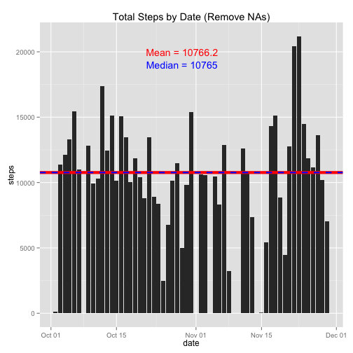

# Reproducible Research: Peer Assessment 1
## [github.com/l0neJT](http://www.github.com/l0neJT)
## 9 June 2014

### Introduction
This assignment demonstrates the use of [R Markdown](http://rmarkdown.rstudio.com/) in conjunction with the [knitr package](http://cran.r-project.org/web/packages/knitr/index.html) to produce literate code. Forked from [rdpeng/RepData_PeerAssessment1](http://github.com/rdpeng/RepData_PeerAssessment1).

### Loading and preprocessing the data
1. Load packages [plyr](http://cran.r-project.org/web/packages/plyr/index.html) and [ggplot2](http://cran.r-project.org/web/packages/ggplot2/index.html)

```r
library(plyr)
library(ggplot2)
```
2. Load data from file activity.csv

```r
dat <- read.csv("./data/activity.csv")
```
3. Transform the 'date' column from factor into date

```r
dat <- transform(dat, date = as.Date(date, format = "%Y-%m-%d"))
str(dat)
```

```
## 'data.frame':	17568 obs. of  3 variables:
##  $ steps   : int  NA NA NA NA NA NA NA NA NA NA ...
##  $ date    : Date, format: "2012-10-01" "2012-10-01" ...
##  $ interval: int  0 5 10 15 20 25 30 35 40 45 ...
```
4. Remove NAs for first analyses

```r
datNoNA <- dat[!is.na(dat$steps), ]
```

### What is mean total number of steps taken per day?
1. Summarise steps by date (excluding NAs)

```r
stepsDate <- ddply(datNoNA, "date", summarise, steps = sum(steps))
```
2. Chart steps by date as a bar plot with mean and median lines

```r
# Bar plot of steps by date without NAs
p <- qplot(date, steps, data = stepsDate, geom = "bar", stat = "identity")

# Horizontal line at mean
pMean <- mean(stepsDate$steps)
p <- p + geom_hline(yintercept = pMean, color = "red", size = 2)
# Label mean line
label <- paste("Mean =", as.character(round(pMean, digits = 2)))
posX <- with(stepsDate, date[round(length(date) / 2)])
posY <- 20000
p <- p + annotate("text", x = posX, y = posY, label = label, color = "red")

# Horizontal line at median
pMedian <- median(stepsDate$steps)
p <- p + geom_hline(yintercept = pMedian, color = "blue", linetype = 2, size = 1)
# Label median line
label <- paste("Median =", as.character(pMedian))
posY <- 19000
p <- p + annotate("text", x = posX, y = posY, label = label, color = "blue")

# Print plot
p
```

 

```r
rm(p, label, posX, posY)
```

### What is the average daily activity pattern?
1. Summarise steps by interval (excluding NAs)

```r
stepsIntv <- ddply(datNoNA, "interval", summarise, steps = mean(steps))
```
2. Chart steps by date as a bar plot with mean and median lines

```r
# Bar plot of steps by date without NAs
p <- qplot(interval, steps, data = stepsIntv, geom = "line")

# Max label

# Print plot
p
```

 

```r
rm(p)
```

### Imputing missing values

### Are there differences in activity patterns between weekdays and weekends?
